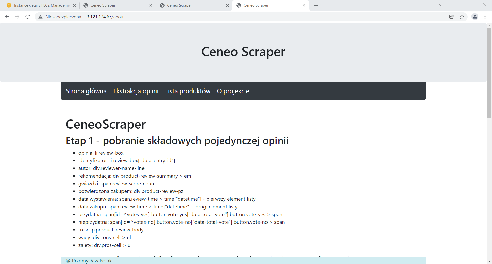

# Automatyczna instalacja aplikacji + serwera proxy
## Instalacja aplikacji
- Zainstaluj python3, python3-pip, oraz git
- Pobierz repozytorium zawierające aplikację
- Stwórz użytkownika
- Ustaw uprawnienia
- Stwórz wirtualne środowisko venv
- Skopiuj plik konfiguracyjny do systemd
- Uruchom usługę
## Serwer proxy
- Zainstaluj EPEL
- Zainstaluj nginx
- Skopiuj plik konfiguracyjny "lb.conf"
- Przeładuj usługę
## Infrastruktura sieciowa
- Adresy IP aplikacji:
    - 3.126.121.19
    - 3.71.90.171
- Adres IP serwera proxy:
    - 3.121.174.67
## Screen aplikacji
