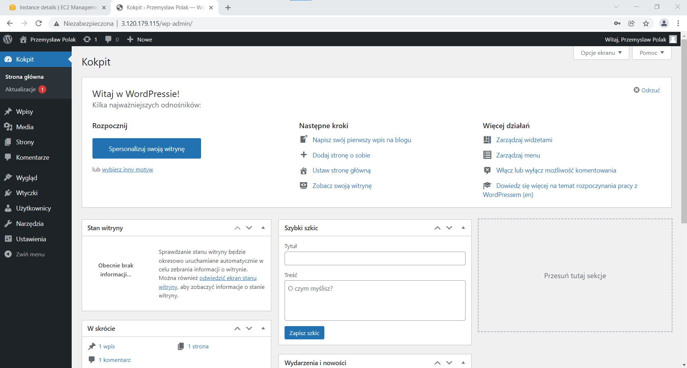

# Automatyczna instalacja wordpress
## Związane z bazą danych
- Stwórz  folder "blog"
- Skopiuj repozytorium bazy danych MariaDB
- Zainstaluj MariaDB: 
    - MariaDB-server
    - MariaDB-client
- Uruchom MariaDB
- Zainstaluj MySQL-python
## Związane z systemem
- Zainstaluj serwer http
- Zainstaluj EPEL
- Skopiuj repozytorium PHP
- Zainstaluj PHP:
    - php80-php
    - php80
    - php80-php-mysqlnd
    - php80-php-pecl-mysql
## Związane z Wordpress
- Pobierz i wypakuj Wordpress
- Skopiuj plik konfiguracyjny "blog-vhost.conf"
- Skopiuj plik konfiguracyjny "wp-config.php"
- Stwórz bazę danych Wordpress
- Dodaj do niej użytkownika, hasło i nadaj uprawnienia
- Przeładuj httpd
## Screen bloga
